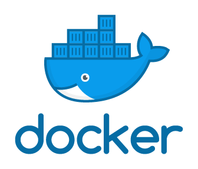

<h1 align="center">Hi , I'm <a>Cagatay</a>  
 Welcome to My GitHub Page</h1>

- 🔭 I’m currently working on **AWS & DevOps**
- 🌱 I am eager to learn cloud computing and devops tools
- 💬 I am passionate to learn and cooperate, and I am eager to share my knowledge
- ⚡ An individual who tries to improve and update myself in the field of software and to benefit people on this platform. Especially DevOps & Cloud Engineer enthusiast
- 📫 How to reach me: cagatayakkiran3757@gmail.com

 

## SKILLS & TOOLS
            

## CERTIFICATIONS

</a>

## AWS Projects
| # Name                  |                                                    Topics                                                                                 |
| ----------------------- | :---------------------------------------------------------------------------------------------------------------------------------------: |
| Flask-Web-Application       |[Handling Routes, Templates , Forms and SQL with Flask Web Application](https://github.com/cagatayakk/AWS_Projects/tree/main/Flask)         |
|                         |                                                                                                                                      | 

