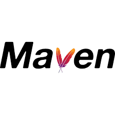
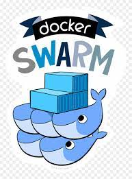

<h1 align="center">Hi , I'm <a>Cagatay</a>  
 Welcome to My GitHub Page</h1>

- 🔭 I’m currently working on **AWS & DevOps**
- 🌱 I am eager to learn cloud computing and devops tools
- 💬 I am passionate to learn and cooperate, and I am eager to share my knowledge
- ⚡ An individual who tries to improve and update myself in the field of software and to benefit people on this platform. Especially DevOps & Cloud Engineer enthusiast
- 📫 How to reach me: cagatayakkiran3757@gmail.com

 

## SKILLS & TOOLS
<a href="https://aws.amazon.com/de/?nc2=h_lg" target= "_blank" rel="noreferrer"> 
 
<a href="https://hub.docker.com/" target= "_blank" rel="noreferrer"> 
 
<a href="https://kubernetes.io/de/" target= "_blank" rel="noreferrer"> 

<a href="https://www.ansible.com" target= "_blank" rel="noreferrer"> 
 
<a href="https://www.terraform.io/" target= "_blank" rel="noreferrer"> 
 
<a href="https://www.jenkins.io/" target= "_blank" rel="noreferrer"> 
 
<a href="https://maven.apache.org/index.html" target= "_blank" rel="noreferrer"> 
 
<a href="https://hub.docker.com/" target= "_blank" rel="noreferrer"> 
 
<a href="https://grafana.com/grafana/download" target= "_blank" rel="noreferrer"> 
 
<a href="https://prometheus.io/docs/introduction/overview/" target= "_blank" rel="noreferrer"> 

<a href="https://www.linux.org/" target= "_blank" rel="noreferrer"> 

<a href="https://www.gnu.org/software/bash/" target= "_blank" rel="noreferrer"> 
 
<a href="https://www.mysql.com/de/" target= "_blank" rel="noreferrer"> 

<a href="https://www.python.org/" target= "_blank" rel="noreferrer"> 

<a href="https://git-scm.com/" target= "_blank" rel="noreferrer"> 
 
<a href="https://www.atlassian.com/de/software/jira" target= "_blank" rel="noreferrer"> 

<a href="https://www.atlassian.com/agile" target= "_blank" rel="noreferrer"> 

## CERTIFICATIONS

</a>

## AWS Projects
|  Name                  |                                                    Description                                                                       |
| ----------------------- | :---------------------------------------------------------------------------------------------------------------------------------------: |
| Flask-Web-Application       |[Handling Routes, Templates, Forms and SQL with Flask Web Application](https://github.com/cagatayakk/AWS_Projects/tree/main/Flask)|
|CloudFormation| [Creating Cloud architecture using AWS Cloudformation Service with other AWS Services and by scripting Template files](https://github.com/cagatayakk/AWS_Projects/tree/main/CloudFormation)|
|Project-101   |[Kittens Carousel Static Website deployed on AWS EC2 using Cloudformation](https://github.com/cagatayakk/AWS_Projects/tree/main/Project-101-kittens-carousel-static-website-ec2)| 
|Project-102     | [Roman Numerals Converter Application (Python Flask) deployed on AWS EC2 with Cloudformation and AWS CLI](https://github.com/cagatayakk/AWS_Projects/tree/main/Project-102-Roman-Numerals-Converter)|
|Project-103   | [Phonebook Application (Python Flask) deployed on AWS Application Load Balancer with Auto Scaling and RDS using AWS Cloudformation](https://github.com/cagatayakk/AWS_Projects/tree/main/Project-103-Phonebook-Application)|
|Project-104   | [Kittens Carousel Static Website deployed on AWS Cloudfront, S3 and Route 53 using Cloudformation](https://github.com/cagatayakk/AWS_Projects/tree/main/Project-104-kittens-carousel-static-web-s3-cf)|
|Project-501   | [Capstone Project - Blog Page App (Django) on AWS Environment](https://github.com/cagatayakk/AWS_Projects/tree/main/Project-501-Capstone-Project-Blog-Page-App-(Django)-on-AWS-Environment)|

## DevOps Projects
|  Name                  |                                                    Description                                                                       |
| ----------------------- | :---------------------------------------------------------------------------------------------------------------------------------------: |
|Project - 201             | [Phonebook Application (Python Flask) deployed on AWS Application Load Balancer with Auto Scaling and Relational Database Service using Terraform](https://github.com/cagatayakk/DevOps_Projects/tree/main/Project-201-Terraform-Phonebook-Application-deployed-on-AWS)|
|Project - 202             | [Dockerization of Bookstore Web API (Python Flask) with MySQL ](https://github.com/cagatayakk/DevOps_Projects/tree/main/Project-202-dockerization-bookstore-api-on-python-flask-mysql)|
|Project - 203             | [Docker Swarm Deployment of Phonebook Application (Python Flask) with MySQL ](https://github.com/cagatayakk/DevOps_Projects/tree/main/Project-203-docker-swarm-deployment-of-phonebook-app-on-python-flask-mysql-Terraform)|

